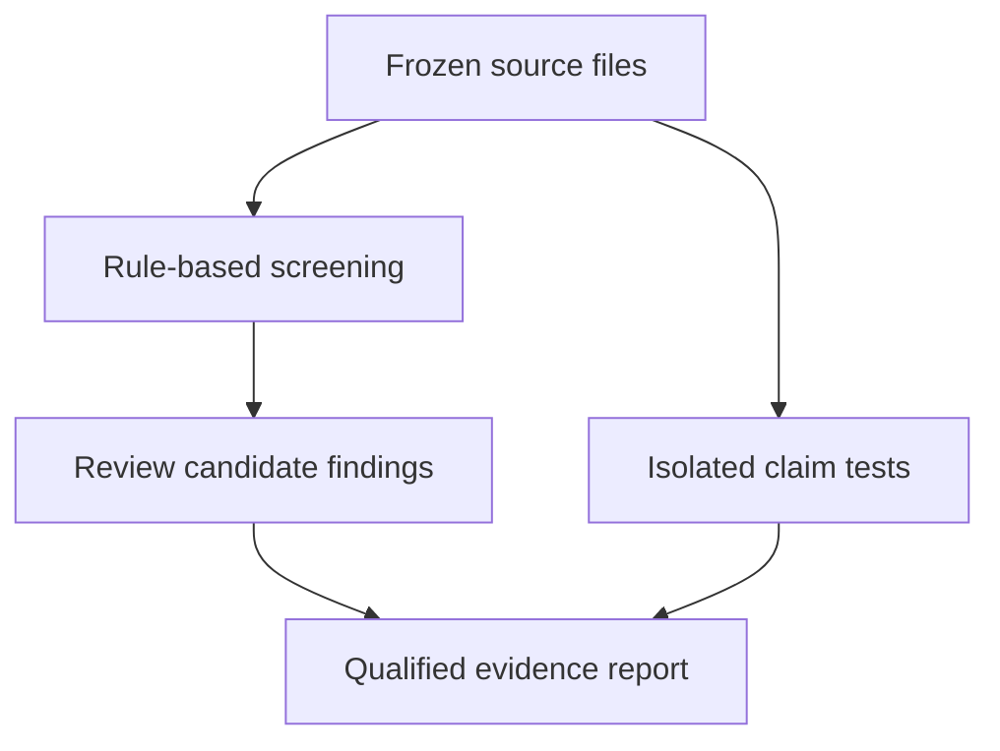

# ResearchAudit

**Multi-Agent Validation for Quantitative and Risk Analytics**
I am developing an audit workflow for quantitative and risk analytics projects. The **rule-based audit baseline and isolated transaction-cost checks** are now implemented. The multi-agent system remains planned.


## Status

 ResearchAudit is my project for checking the maths, algorithms, code, and claims of the Quant AI Market Lab, to see whether they are correct and justified. I have frozen the Quant AI Market Lab at v1.0.0 and published a clean snapshot of it in this repository, so every finding refers to a fixed version.

I am building the audit in two stages. First, I have built a rule-based checker and tested its screening rules using designed examples, regression probes and the frozen Quant AI Market Lab snapshot. These checks do not measure independent real-world detection accuracy. Then I plan to build a multi-agent system with four AI agents: a math checker, a code and implementation checker, a methodology and/or domain-soundness checker, and a skeptic. The skeptic challenges the verdicts of the other three and asks them to support their answers with evidence, so that no verdict is accepted without scrutiny. A coordinator, written as plain Python, will send questions to the agents, repeat them to test whether the answers are consistent, and produce a final report.

I am planning to run everything locally with Ollama, without a third-party AI API, so the whole system can be run and inspected on my own machine. A local model may reason less well than a cloud model on complex judgments, so the report will mark claims that remain disputed or unresolved instead of hiding them.

## Baseline release: 10 October 2026

I checked 34 Python files from the frozen Quant AI Market Lab source and obtained 10 candidate findings. I reviewed these locations; I confirmed no look-ahead error among those flagged locations. This does not establish that the whole project is leakage-free.

I also tested the extracted transaction-cost function. **Claim 7 is supported for the tested cases, with two input-validation gaps found in the audited function; the full backtest and its numerical results are not reproduced.** Two tests deliberately characterize those gaps. I leave the frozen audited source unchanged.

| Stage | What I have completed | What remains |
|---|---|---|
| Frozen target | Quant AI Market Lab v1.0.0 snapshot and source fingerprints. | A second complete frozen project. |
| Rule-based baseline | Syntax screening, file coverage, reports and human triage. | Independent detection-accuracy evaluation. |
| Tests | 52 test methods pass; 20 designed examples are exercised within one test. | Broader independently labelled defects and clean controls. |
| Claim inventory | C01-C06 retain their provisional inspection labels; C07 now has isolated-case support and documented gaps. | Full financial-result reproduction and broader mathematical audit. |
| Multi-agent system | Architecture proposal. | Agent implementation, coordinator, Ollama setup and comparative evaluation. |



### What the checker adds

I screen literal future-use patterns (`shift`, `diff` and `pct_change` with negative periods, plus `rolling(center=True)`), shuffled splits, transformation fit locations, selected seed patterns, unused sensitive parameters, absolute paths, exceptions and test-file presence. Findings require review. I record unreadable or unparseable files, excluded paths and readable-source hashes. Complete scan coverage means eligible files were readable and parsed, not that the research is correct.

I do not resolve variable-valued periods or shuffle settings, aliased split imports such as `train_test_split as tts`, RandomState tracking, or lambda execution/seed paths. A fixed seed inside `if __name__ == "__main__":` can produce a conservative unseeded warning. My [checker notes](docs/rule_based_checker.md) and reports list the blind spots.

### Run the baseline

From the repository root, with Python 3.12:

```bash
python -m pip install -r requirements.txt
PYTHONPATH=src python -m unittest discover -s tests -v
PYTHONPATH=src python -m researchaudit.rule_checker targets/quant-ai-market-lab-v1.0.0 --out results/reproduced_baseline
PYTHONPATH=src python -m evaluation.run_seeded_evaluation
```

The checker refuses to overwrite reports unless I explicitly use `--force`; I normally choose a fresh output directory. The seeded evaluator regenerates only its designed-case CSV. No CVXPY or market data are needed for the isolated tests; I do not run the portfolio backtest.

### Evidence and limits

- [Claim inventory](claims/claim_inventory.md) and [qualified transaction-cost note](claims/claim_07_transaction_costs.md).
- [Baseline evaluation](docs/baseline_evaluation.md), [checker implementation](src/researchaudit/rule_checker.py), [tests](tests/), and [references](docs/references.md).
- [Current report](results/published_baseline/rule_checker_quant-ai-market-lab-v1.0.0.md), [JSON coverage and findings](results/published_baseline/rule_checker_quant-ai-market-lab-v1.0.0.json), and [human triage](results/rule_checker_triage.md).
- [Snapshot provenance](snapshot_provenance.json) and [local verification record](results/baseline_verification.json).

I do not write "all seven claims verified." Passing the two known-gap characterization tests records defects, not corrected input behaviour. The earlier report under `results/baseline/` is retained as historical evidence and is distinct from the current checker.

## Why I Want to Build This

My academic background is in mathematics, computer science and system sciences. As I move from academic research towards quantitative research, data science and risk analytics roles, I want to study whether multi-agent systems can evaluate technical work in a rigorous and reproducible way.

ResearchAudit will be developed as an independent project using frozen versions of two projects that I am already working on:

* **Quant AI Market Lab**, focused on quantitative market analysis
* **PaymentGuard**, focused on transaction-risk analysis and constrained decision-making

The purpose is not to combine these projects or repeat their analyses. Instead, ResearchAudit will treat completed components from them as audit targets and test whether different reviewing approaches can detect mathematical, statistical, data-validation and reproducibility problems.

Only components that have actually been completed in the source projects will be included. Planned or unfinished work will remain outside the audit until it has been implemented and documented.

